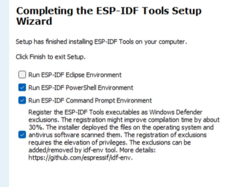
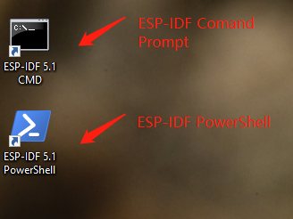
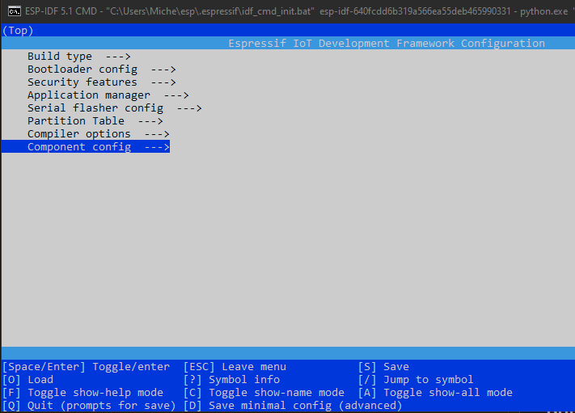
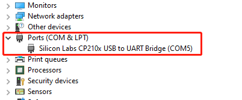
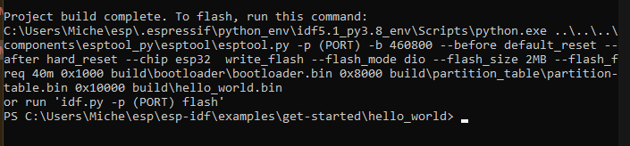
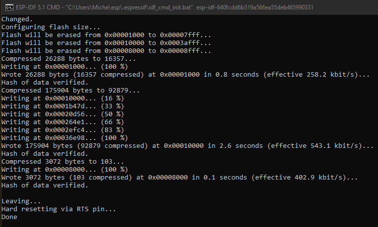
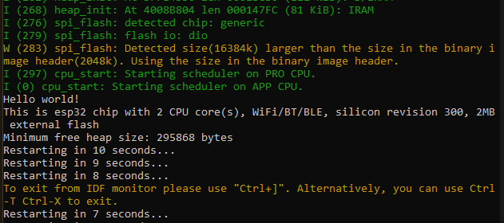

# Install ESP-IDF on Windows
- Please refer to ESP-IDF's official documentation [Standard Toolchain Setup for Windows](https://docs.espressif.com/projects/esp-idf/en/latest/esp32/get-started/windows-setup.html#esp-idf-tools-installer)

- Please also refer to [Mair's video tutorial for installation on Windows](https://learnesp32.com/videos/1/1_%5Bwindows%5D%20installing%20the%20esp-idf)

## Get ESP-IDF Tools Installer
 Download one of ESP-IDF Tools Installer
 [ESP-IDF Tools Installer](https://docs.espressif.com/projects/esp-idf/en/latest/esp32/get-started/windows-setup.html)

>:bulb: It is recommended to install ESP-IDF directly under your local drive, for example:
```c
// Will install ESP-IDF master into:
      C:\esp\esp-idf
// IDF tools directory (IDF_TOOLS_PATH): 
      C:\esp\tools\.espressif
```
At the end of the installation process, choose the prompt you would like to use to launch ESP-IDF environment, for example:

 

Note that when launching the ESP-IDF Command Prompt, it automatically runs `export.bat` script to set up the environment variables (`PATH`, `IDF_PATH` and others)

 

## Start an example project
ESP-IDF provides a sample project called `hello_world`, launch your ESP-IDF environment and navigate to the folder where `hello_world` locates

```sh
cd \Users\<UserName>\esp\esp-idf\examples\get-started\hello_world
```

### Configure your project 
After you navigate to the `hello_world `directory, set ESP32 as the target, and run the project configuration utility `menuconfig`

```sh
# existing builds and configurations in the project will be cleared and initialized in this process
idf.py set-target esp32 

# using this menu to set up project specific variables, 
# e.g., Wi-Fi network name and password, the processor speed, etc
idf.py menuconfig
```



### Connect your device
Connect your ESP32 board to the computer and check under which serial port the board is visible

To check your device's COM port, go to `Device Manager -> Ports(COM & LPT)`. Disconnect your board and connect it back, to verify which port disappears from the list and then shows back again



### Build your project
To build the example project, run
```sh 
idf.py build
```
If succeed, you should see the following output



### Flash onto the device
Run the following command
```sh
idf.py -p (PORT) flash
```
Replace `PORT` with your ESP32 board’s USB port name. If the `PORT` is not defined, the idf.py will try to connect automatically using the available USB ports

You should see the following output



### Monitor the output
To check if `hello_world` is indeed running, run
```sh
idf.py -p (PORT) monitor 
```
Output



Finally to terminate the process
```sh
Control + ]
```

# Install ESP-IDF on Windows via WSL2 
Please refer to Hwan's documentation [doc-tinyml](https://github.com/MACSO-AI/doc-tinyml/blob/main/main.pdf)
