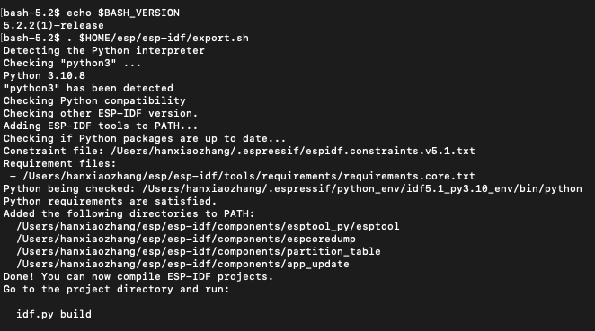
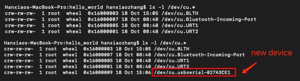
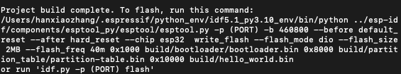
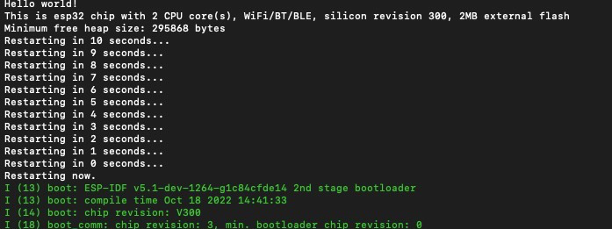

# Install ESP-IDF on macOS
Please refer to ESP-IDF's official documentation [Standard Toolchain Setup for Linux and macOS](https://docs.espressif.com/projects/esp-idf/en/latest/esp32/get-started/linux-macos-setup.html)


## Install Git, HomeBrew, CMake & Ninja build
<details><summary>Details (click to expand...)</summary>

Check your git version 
```
git --version
```

Install HomeBrew
```sh
ruby -e "$(curl -fsSL https://raw.githubusercontent.com/Homebrew/install/master/install)"
```
Install CMake & Ninja build 
```
brew install cmake ninja dfu-util
```
It is strongly recommended to also install `ccache` for faster builds
```
brew install ccache
 ```

  
> Note that if you encounter the following error during any steps
> ```
> xcrun: error: invalid active developer path (/Library/Developer/CommandLineTools), missing xcrun at: /Library/Developer/CommandLineTools/usr/bin/xcrun
>```
> Then you will need to install the XCode command line tools to continue. You can install these by running
>```
>xcode-select --install
>```


</details>

## Install Python3
<details><summary>Details (click to expand...)</summary>

Check if you already have python3 installed 
```
python3 --version
```
If you don't have python, install it via HomeBrew
```
brew install python3
```
## Get ESP-IDF
Navigate to your installation directory 
```bash
mkdir -p ~/esp
cd ~/esp
git clone --recursive https://github.com/espressif/esp-idf.git
```

>ESP-IDF will be downloaded into `~/esp/esp-idf`
 </details>

## Set up ESP-IDF-related tools
<details><summary>Details (click to expand...)</summary>

To install tools for ESP32

```sh
cd ~/esp/esp-idf
./install.sh esp32
```
> For more tools installation options please refer to their [official document](https://docs.espressif.com/projects/esp-idf/en/latest/esp32/get-started/linux-macos-setup.html)
 </details>
 
## Set up the environment variables
### 1. Make sure you have the latest version of Bash
>When exporting environment variables, you make get the following warning if your bash version is outdated 
>```
>WARNING: Failed to load shell autocompletion for bash version: 3.2.57(1)-release!
>```
>To fix this you need to update your bash

<details><summary>Details (click to expand...)</summary>

Check your bash version 
```bash
bash --version # if it is v3.2 means it is outdated
```
Install the latest version 
```
brew install bash
```
To verify installation
```bash
which -a bash

/bin/bash # old version
/usr/local/bin/bash # new version

````
To use the latest Bash shell as the default shell, you need to add its path to`/ect/shells` file
```bash
sudo vim /etc/shells # edit file via vim
```
Add `/usr/local/bin/bash` shell to its content
```
/bin/bash
/bin/csh
/bin/ksh
/bin/sh
/bin/tcsh
/bin/zsh
/usr/local/bin/bash
```

Finally run the following command to set the new version as the default shell 
```bash
chsh -s /usr/local/bin/bash
```
Note that when you run  `bash` it will invoke `/usr/local/bin/bash`
```bash
bash
bash-5.0$ echo $BASH_VERSION
5.0.0(2)-release
```

To exit bash simply type 
```
exit
```

</details>

### 2. Export environment variables

<details><summary>Details (click to expand...)</summary>
The installed tools are not yet added to the PATH environment variable. To make the tools usable from the command line, some environment variables must be set

```sh
. $HOME/esp/esp-idf/export.sh
```

The output looks like this


</details>


# Start an example project
Copy the project `get-started/hello_world` to `~/esp `directory
```sh
cd ~/esp
cp -r $IDF_PATH./esp-idf/examples/get-started/hello_world .
```

## Connect your device
Now connect your ESP32 board to the computer and check under which serial port the board is visible, the following command shows all serial ports on your device
```sh
ls /dev/cu.* 
```
Now plug in your ESP32 and run the above command again, you should see a new port name appear


## Build your project
First, make sure you have set the environment variables (See [Export environment variables](#export-environment-variables))
 
 If you haven't already done so, run 
```sh
. $HOME/esp/esp-idf/export.sh
```

To build the example project, run
```bash
idf.py build 
```

If succeed, you should see this 



## Flash onto the device
To flash the device, run 
```sh
idf.py -p (PORT) flash
```
Replace `PORT` with your ESP32 board’s USB port name, for example in my case it will be 
```sh
idf.py -p /dev/cu.usbserial-027A3CE1 flash monitor
```
Note that I also added `monitor` command in order to monitor the flashing process



Finally to terminate the process
```sh
Control + ]
```