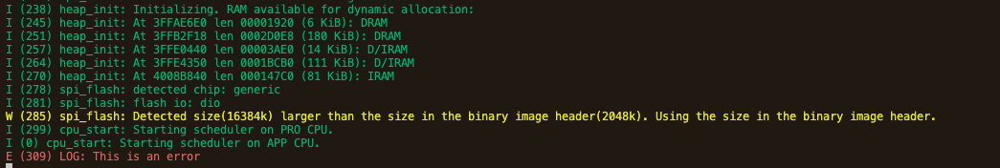
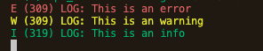
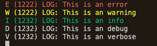
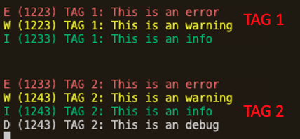
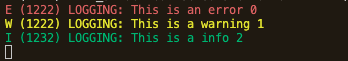

# Logging


>Definition: 
>```c
> #define ESP_LOGE(tag, format, ...) 
>// tag – description tag
>// format - format string
>```

Need to include the header file `"esp_log.h"`, for example, we can log an error like this:


```c
// copy the following code to main.c in the starter template
#include <stdio.h>
#include "esp_log.h"

void app_main(void)
{
    ESP_LOGE("LOG", "This is an error"); 
}
```

```sh
#flash the device
idf.py flash monitor 
```


Output:


Other log options:

- `ESP_LOGE` - error
- `ESP_LOGW` - warning
- `ESP_LOGI` - info
- `ESP_LOGD` - debug
- `ESP_LOGV` - verbose

## Set the logging level 
### Option 1 - menuconfig
Note that `ESP_LOGD` and `ESP_LOGV` are disabled by default, to change settings, run 
```
idf.py menuconfig
```
Then navigate to `Component config -> Log Output -> Default log verbosity(Info)` and set the default log verbosity to `Verbose`


For example, if we run this code
```c
#include <stdio.h>
#include "esp_log.h"

void app_main(void)
{
    ESP_LOGE("LOG", "This is an error");
    ESP_LOGW("LOG", "This is an warning");
    ESP_LOGI("LOG", "This is an info");
    ESP_LOGD("LOG", "This is an debug");
    ESP_LOGV("LOG", "This is an verbose");
}
```
We will only receive log output for E/W/I since the maximum verbosity level is set to `Info` by default



After setting the maximum verbosity level to `Verbose`, we get 




### Option 2 - use function `esp_log_level_set()`
We can also use the function `esp_log_level_set(tag, level)` to specify logging level for a particular tag 
```c
#include <stdio.h>
#include"esp_log.h" 

void app_main(void)
{
    // set logging level to Info will include Info, Warning, Error
    esp_log_level_set("LOG", ESP_LOG_INFO); 

    ESP_LOGE("LOG", "This is an error");
    ESP_LOGW("LOG", "This is an warning");
    ESP_LOGI("LOG", "This is an info");
    ESP_LOGD("LOG", "This is an debug");
    ESP_LOGV("LOG", "This is an verbose");

    // set logging level to Debug will include Debug, Info, Warning, Error
    esp_log_level_set("TAG 2", ESP_LOG_DEBUG);
    ESP_LOGE("TAG 2", "This is an error");
    ESP_LOGW("TAG 2", "This is an warning");
    ESP_LOGI("TAG 2", "This is an info");
    ESP_LOGD("TAG 2", "This is an debug");
    ESP_LOGV("TAG 2", "This is an verbose");
}
```
Output:



## printf
Note that `ESP_LOG` also supports format print:
```c
void app_main(void)
{
  // set logging level to info
  esp_log_level_set("LOGGING", ESP_LOG_INFO);

  int myNumber = 0; //increment number
  ESP_LOGE("LOGGING", "This is an error %d", myNumber++);
  ESP_LOGW("LOGGING", "This is a warning %d", myNumber++);
  ESP_LOGI("LOGGING", "This is a info %d", myNumber++);
  ESP_LOGD("LOGGING", "This is a debug %d", myNumber++);
  ESP_LOGV("LOGGING", "This is verbose %d", myNumber++);
}
```
Output:




# Reference

-  ESP-IDF's official documentation - [Logging Library](https://docs.espressif.com/projects/esp-idf/en/latest/esp32/api-reference/system/log.html) 
-  [Learn Esp32 with ESP-IDF - 3. A First Look](https://bbs.scumaker.org/t/topic/246)
-  [ESP-IDF for Arduino Users, Tutorials Part 1: Logging](https://aliafshar.medium.com/esp-idf-tutorials-part-1-logging-f704d8308952)