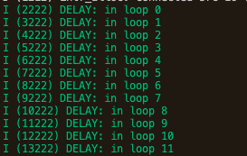

# Delays

Need to include the following two header files and use the function `vTaskDelay()`
```c
#include "freertos/FreeRTOS.h"
#include "freertos/task.h"
```
The function `vTaskDelay`（v means void）can delay a task for a given number of ticks. The actual time that the task remains blocked depends on the tick rate (the frequency of the actual chip)

The constant `portTICK_PERIOD_MS` can be used to convert a time from ticks to milliseconds

Example
```c
#include <stdio.h>
#include "esp_log.h"
#include "freertos/FreeRTOS.h"
#include "freertos/task.h"

#define TAG "DELAY"

void app_main(void)
{
    int i = 0; // increment
    while (1) {
        vTaskDelay(1000 / portTICK_PERIOD_MS); // block for 1000ms
        ESP_LOGI(TAG, "in loop %d", i++);
    }
}
```

Output



# Reference

-  ESP-IDF's official documentation - [FreeRTOs](https://docs.espressif.com/projects/esp-idf/en/latest/esp32/api-reference/system/freertos.html) 