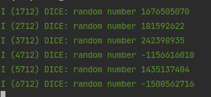
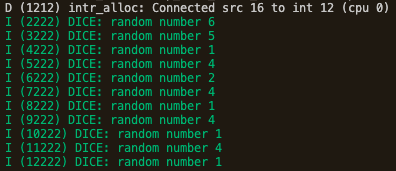

# Random Number
Need to include the following two header files
```c
#include "esp_system.h"
#include "esp_random.h"
```
Example
```c
#include <stdio.h>
#include "freertos/FreeRTOS.h"
#include "freertos/task.h"
#include "esp_log.h"
#include "esp_system.h"
#include "esp_random.h"

#define TAG "DICE"

void app_main(void)
{
    while (1) {
        vTaskDelay(1000 / portTICK_PERIOD_MS);
        ESP_LOGI(TAG, "random number %d", esp_random());
    }
}
```
Output



Note that the above number is really large, we can set a range for a random number

The following dice example set range for rand from int 1 - int 6

```c
#include <stdio.h>
#include "freertos/FreeRTOS.h"
#include "freertos/task.h"
#include "esp_log.h"
#include "esp_system.h"
#include "esp_random.h"
#include "math.h" // need to include math.h for calculation

#define TAG "DICE"

int dice_role() {
    int random = esp_random(); // get random number 
    int positiveNumber = abs(random); // make sure it is only positive
    
    // modular ensures n % 6 = 0-5, so we need to plus 1  
    int diceNumber = (positiveNumber % 6) + 1; 
    return diceNumber;
}

void app_main(void)
{
    while (1) {
        vTaskDelay(1000 / portTICK_PERIOD_MS);
        ESP_LOGI(TAG, "random number %d", dice_role());
    }
}
```

Output

