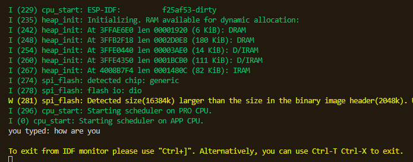

# Keyboard Input
Need to include the following header file
```c
#include <string.h> 
```

Example
```c
#include <stdio.h>
#include <string.h>
#include "freertos/FreeRTOS.h"
#include "freertos/task.h"

void app_main(void)
{
    char c = 0;
    char str[100];
    memset(str, 0, sizeof str);
    while (c != '\n') {
        c = getchar();
        if (c != 0xff) {
            str[strlen(str)] = c;
            printf("%c", c);
        }
        vTaskDelay(100 / portTICK_PERIOD_MS);
    }

    printf("you typed: %s\n", str);
}
```
Output


